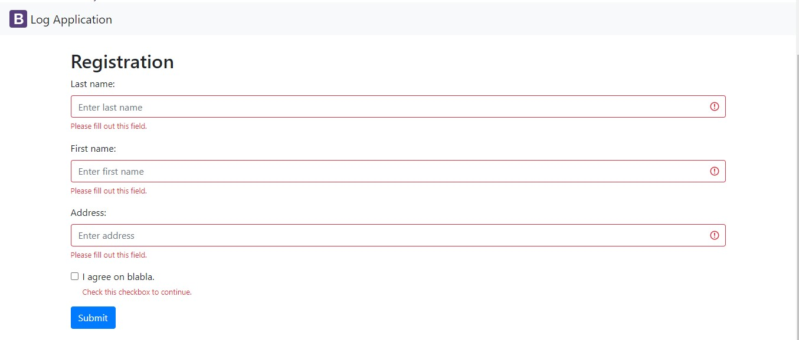
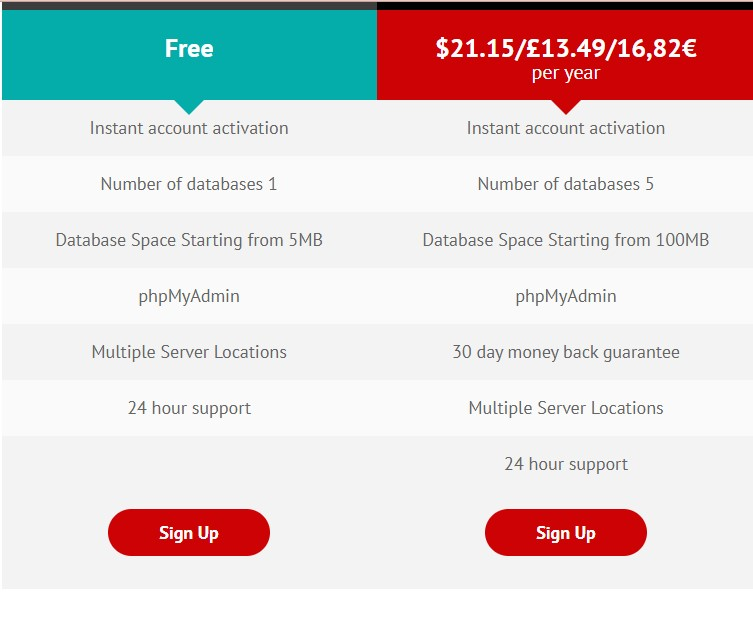
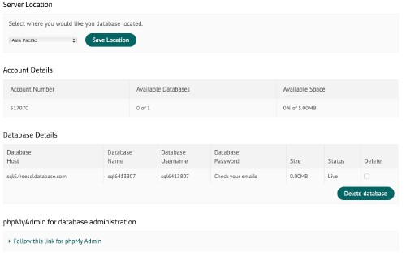

# Log App

 In the midst of a pandemic, logbooks are commonly found in malls, supermarkets, and schools, among other places. The logApp is a sample application that tracks a person's personal information as well as the date and time they visited a location.  
 To protect an individual's personal information (RA 10173, Data Privacy Act of 2012), only users with an admin account can view the list of individuals who visited the premises.

This is an example of Log App

# Installation

To setup your phpMyAdmin, please follow the steps below:

1. **Create an account in freesql**
- Visit the link https://www.freesqldatabase.com
- Sign up for free

- Provide an Email address and password the click register.

2. **Once you are done in creating an account, Log in to your account, create a database and take note your database details. It should look something like this.**

3. Click the "Follow this link for phpMy Admin"
4. Setup your database:
-Create tables - PERSON(pid, lastname, firstname, address, logdt) and USERACCOUNT(uid,
username, password)
- Make sure to set logDT data type to TIMESTAMP and default value to CURRENT_TIMESTAMP
- Add atleast one (1) row in USERACCOUNT table so you can test the Log In page.

# Authors
The following are the authors of this Log App.

## **Adrian Dave Convocar**

## **Carl Kobe Velasco**

## **Shaira Gay Pascua**

